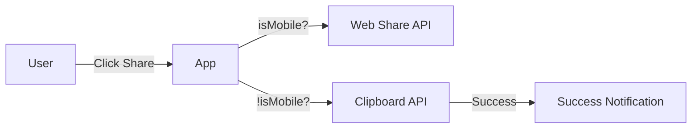

# Requirements

### Overview & Goals
The goal is to provide a more flexible way for wedding administrators to share the app with guests. While QR codes are great for physical prints, digital sharing (via WhatsApp, email, etc.) is essential for modern coordination.

### Scope
- **In Scope**:
  - Adding a "Send link" button to the Admin View.
  - Integration with Web Share API for mobile devices.
  - Clipboard copy fallback for desktop devices.
  - Integration with existing notification system.
- **Out Scope**:
  - Email client integration (direct `mailto:` links).
  - Short URL service integration.

# Technical Design

### Current Implementation
The Admin View currently allows users to generate and print a QR code. The URL shared is always the current page URL (`window.location.href`).

### Proposed Changes
1.  **UI Modification**: Add a second button in the `admin-actions` section of `index.html`.
2.  **Logic Integration**:
    *   **Mobile**: Use `navigator.share({ title: 'Nuestra Boda', text: '¡Sube tus fotos a nuestra boda!', url: window.location.href })`.
    *   **Desktop**: Use `navigator.clipboard.writeText(window.location.href)` and show the `notification-overlay` with a message saying the link was copied.

### File Structure
- `index.html`: Add button.
- `src/app.ts`: Add logic and event listeners.
- `style.css`: Ensure buttons are styled correctly (possibly side-by-side or stacked).

### Architecture Diagram

# Testing

### Validation Approach
- **Manual Verification**: Test on a mobile browser to ensure the native share sheet opens. Test on desktop to ensure the "Link copied" notification appears and the clipboard actually contains the URL.
- **Automated Tests**:
  - Verify that the `share-link-btn` exists.
  - Mock `navigator.share` and `navigator.clipboard` to ensure they are called correctly when the button is clicked.

# Delivery Steps

### ✓ Step 1: Update Admin UI with "Send link" button
Add the "Send link" button to the Admin panel UI.

- Modify `index.html` to include a new button with id `share-link-btn` in the `admin-actions` div.
- Add appropriate FontAwesome icons and classes to match the existing design.
- Update `style.css` if necessary for spacing between the two buttons.

### ✓ Step 2: Implement Share/Copy Link logic in app.ts
Implement the sharing logic in the application.

- Update `elements` object in `src/app.ts` to include `shareLinkBtn`.
- Implement `handleShareLink` function in `src/app.ts` using `navigator.share` with a fallback to `navigator.clipboard.writeText`.
- Attach the event listener in `initEventListeners`.
- Show a success notification using the existing `showNotification` helper when copying to clipboard.

### ✓ Step 3: Validation and Testing
Ensure the sharing functionality works as expected and doesn't break existing features.

- Add a unit test in a new test file or existing one to verify the share button logic.
- Verify that "Print QR" still works correctly.